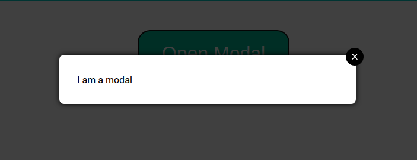
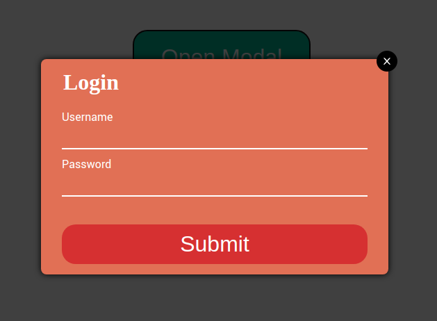
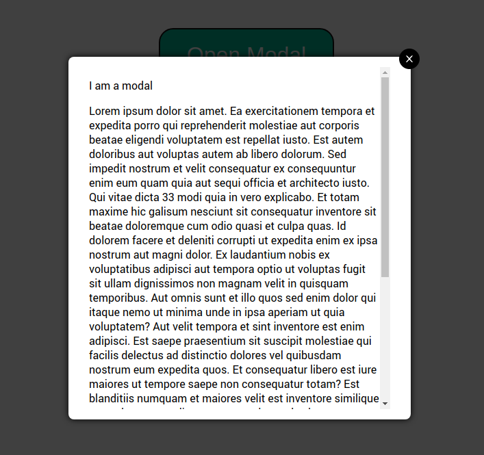
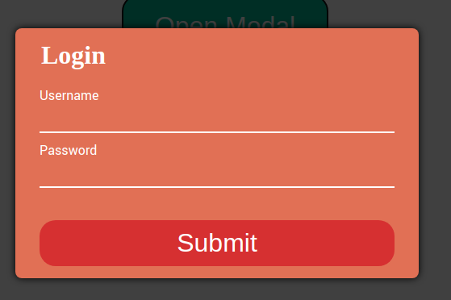

# Modal-react-module for React

Modal-react-module is a complete modal for the react project for the web.

## Installation

```

    npm i modal-react-modal

```

## Usage

Import Modal component and the hook useModal from "modal-react-module" where you want to use this.

```jsx
import React from "react";
import Modal, { useModal } from "modal-react-module";

function App() {
  const [showModal, setShowModal, showSpinner, setShowSpinner] = useModal();
  return (
    <Modal showModal={showModal} setShowModal={setShowModal}>
      <p>I am a modal</p>
    </Modal>
  );
}
```



In your modal Modal component you can personalize your content to be able to do that we pass the content through a spread operator in the props and we use the props like a children

```jsx
function Modal({ ...props }) {
  return <div>{props.children}</div>;
}
```

```jsx
import React from "react";
import Modal, { useModal } from "modal-react-module";

function App() {
  const [showModal, setShowModal, showSpinner, setShowSpinner] = useModal();
  return (
    <Modal showModal={showModal} setShowModal={setShowModal}>
      <form className="form">
        <label htmlFor="username" />
        <input type="text" id="username" className="form__input" />
        <label htmlFor="lastName" />
        <input type="text" id="lastname" className="form__input" />
        <button type="submit" className="form__button">
          Submit
        </button>
      </form>
    </Modal>
  );
}
```



Modal is basically responsive, scroll bar is appear if the text is very long



## Modal Css

Modal have a basic css page if you want to use

```jsx
import "modal-react-module/dist/components/Modal.css";
```

or if you want personalize it you can make your own css page

```jsx
import "modal-react-module/dist/components/Modal.css"
import "../example/custom.css
```

You can find all class using on the default css here

- [Modal.css](https://github.com/Yagini/LionelCorre-P14-Modal-react-module/blob/main/src/lib/components/Modal.css)

## Props

All of native modal-react-module props can be passed to the component.

### _`Defaults Props`_

showModal and setShowModal is using for make a modal appear

```jsx
function App() {
  const [showModal, setShowModal, showSpinner, setShowSpinner] = useModal();
  return (
    <div>
      <button onClick={setShowModal}>Open Modal</button>
      <Modal
        showModal={showModal}
        setShowModal={setShowModal}
        showSpinner={showSpinner}
        setShowSpinner={setShowSpinner}
      >
        <p>I am a modal</p>
      </Modal>
    </div>
}
```

showSpinner and SetShowSpinner is using for make a spinner appear when they have an async function

```jsx
function App() {
  const [showModal, setShowModal, showSpinner, setShowSpinner] = useModal();

  const waitFor = (ms) => new Promise((r) => setTimeout(r, ms));
  const handleClick = async (event) => {
    setShowSpinner();
    await waitFor(2000);
    setShowModal();
  };

  return (
    <div>
      <button onClick={handleClick}>Open Modal</button>
      <Modal
        showModal={showModal}
        setShowModal={setShowModal}
        showSpinner={showSpinner}
        setShowSpinner={setShowSpinner}
      >
        <p>I am a modal</p>
      </Modal>
    </div>
  );
}
```

## `Optionnal props`

### _`unLockClose?: boolean`_

If unLockClose is true you can't close the modal with click and escape button

```jsx
<Modal
  showModal={showModal}
  setShowModal={setShowModal}
  showSpinner={showSpinner}
  setShowSpinner={setShowSpinner}
  unLockClose={true}
>
  <p className="text__color">Content</p>
</Modal>
```

### _`showClose?: boolean`_

For hiding the close button.

```jsx
<Modal showModal={showModal} setShowModal={setShowModal} showClose={false}>
  <p className="text__color">Content</p>
</Modal>
```



### _`showFade?: Boolean`_

You can add a fade effect, the fade effect prevents visibility of the spinner

To customize your fade effect you must change the css content properties in your css custom file

```css
//default className

.modal__fade-in 
.modal__fade-out
@keyframes: fadeInOpacity
@keyframes: fadeOutOpacity
```
```jsx
<Modal showModal={showModal} setShowModal={setShowModal} showFade={true}>
  <p>Content</p>
</Modal>
```

### _`icon?: string`_

You can custom the close icon. </br>
By default the modal have four type of icon: "cross", "exclamation", "heart", "star".</br> 
But if you want your one you just have to change css property on your custom css file. </br> (default className: modal__close-btn)

```css
//default className

.modal__close-btn
```

```jsx
<Modal showModal={showModal} setShowModal={setShowModal} icon="cross">
  <p>Content</p>
</Modal>
```
  

## _`default state of the props and default state in the hook useModal`_

```jsx
  icon = "cross"
  unLockClose = true,
  showClose = true,
  showFade = false,
  ...props
```

```jsx
const [isShowingModal, setIsShowingModal] = useState(false);
const [isShowingSpinner, setIsShowingSpinner] = useState(false);
```

## Contribute

### You want to contribute ?

Go there [CONTRIBUTING.md](https://github.com/Yagini/LionelCorre-P14-Modal-react-module/blob/main/CONTRIBUTING.md)

## License

MIT
